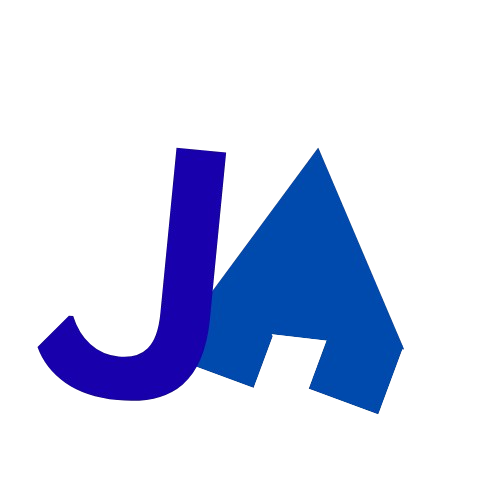

<a name="readme-top"></a>

<br/>

<br />
<div align="center">
  <a href="https://github.com/Jarellealgo/">
    
  </a>

  <h3 align="center">WD-Finals-Portfolio</h3>
</div>

<div align="center">
  A comprehensive portfolio website featuring a modern, responsive design that showcases my educational background, technical skills, and web development projects. Built with HTML5, CSS3, and JavaScript, this site demonstrates my proficiency in front-end development while presenting my journey as a cybersecurity student at FEU Institute of Technology.
  
  <h3 align="center">Jarelle Algo</h3>
</div>
<br />


<br />
<br />

<!-- TODO: If you want to add more layers for your readme -->
<details>
  <summary>Table of Contents</summary>
  <ol>
    <li>
      <a href="#overview">Overview</a>
      <ol>
        <li>
          <a href="#key-components">Key Components</a>
        </li>
        <li>
          <a href="#technology">Technology</a>
        </li>
      </ol>
    </li>
    <li>
      <a href="#rules-practices-and-principles">Rules, Practices and Principles</a>
    </li>
    <li>
      <a href="#resources">Resources</a>
    </li>
  </ol>
</details>

---

## Overview

This project is a comprehensive portfolio website showcasing my educational journey, skills, projects, and contact information as a cybersecurity student and aspiring web developer.

### Key Components
- **Homepage**: Professional hero section with personal introduction and quick stats
- **About Me**: Detailed personal information, skills, and hobbies section
- **Education**: Timeline showcasing educational journey from junior high to college
- **Projects**: Portfolio of web development projects including seatwork demonstrations
- **Contact**: Professional contact form and information for networking opportunities
- **Responsive Design**: Mobile-friendly layouts across all pages
- **Modern UI/UX**: Clean design with smooth animations and hover effects
- **Consistent Branding**: Professional color scheme and typography throughout

### Technology


## Rules, Practices and Principles
1. Always use `WD-` in the front of the Title of the Project for the Subject followed by your custom naming.
2. Do not rename any .html files; always use `index.html` as the filename.
3. Place Files in their respective folders.
4. All file naming are in camel case.
   - Camel case is naming format where there is no white space in separation of each words, the first word is in all lower case while the succeding words first letter are in upper followed by lower cased letters.
   - ex.: buttonAnimatedStyle.css
5. Use only `External CSS`.
6. Renaming of Pages folder names are a must, and relates to what it is doing or data it holding.
7. File Structure to follow below.

```
WD-Finals-Portfolio/
├── index.html
├── LICENSE
├── readme.md
├── Assets/
│   ├── css/
│   │   ├── header.css
│   │   └── style.css
│   ├── img/
│   │   └── my_logo.png
│   └── JS/
│       └── js.js
└── pages/
    ├── About me/
    │   ├── index.html
    │   └── Assets/
    │       ├── css/
    │       │   └── style.css
    │       ├── img/
    │       └── JS/
    ├── contact information/
    │   ├── index.html
    │   └── Assets/
    │       ├── css/
    │       │   └── style.css
    │       ├── img/
    │       └── JS/
    ├── Education/
    │   ├── index.html
    │   └── Assets/
    │       ├── css/
    │       │   └── style.css
    │       ├── img/
    │       └── JS/
    │           └── js.js
    └── Projects/
        ├── index.html
        └── Assets/
            ├── css/
            │   └── style.css
            ├── img/
            │   ├── seatwork1.jpg
            │   └── seatwork2.jpg
            └── JS/
```

## Resources

| Title | Purpose | Link | Grade |
|-|-|-|-|

| WD-Finals | Portfolio Website | N/A | TBD | 

